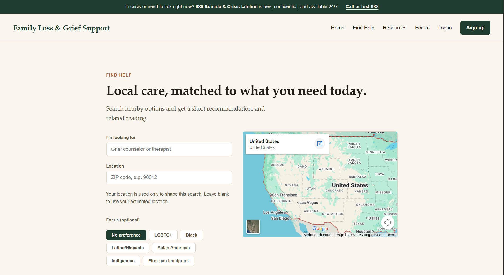

# ❤️ OpenHealing 

OpenHealing helps people experiencing grief discover trusted resources, connect with community support, and access professional care; onboarding for licensed clinicians is planned.




## 🤲 Why OpenHealing 
- **Grief & mental health gap: ~137M Americans** live in areas with shortages in mental health support.
- **Discovery problem: only 46%** of people know where to turn; so many resources often exist but go unfound.
- **Persistent need: 54%** of people struggle to find resources; and for the **57%** that can locate help, see support fade after months.


## ✨ Key features
- Search curated articles by keyword
- Find local resources on a map
- Community forum for ongoing peer support
- LLM-backed recommendations for tailored guidance

## 📦 Quick start
1. Create venv and install:

```powershell
python -m venv .venv
.venv\Scripts\activate
pip install -r requirements.txt
```

2. Set environment variables used by `backend/config.py`:

```powershell
setx FLASK_ENV development
setx GEMINI_API_KEY "<your-key>"
setx SERPAPI_KEY "<your-key>"
```

3. Run locally:

```powershell
python backend/app.py
```

## Tests
- Run unit tests:

```powershell
pip install pytest
pytest -q
```

For API and schema details, see `/docs`.
